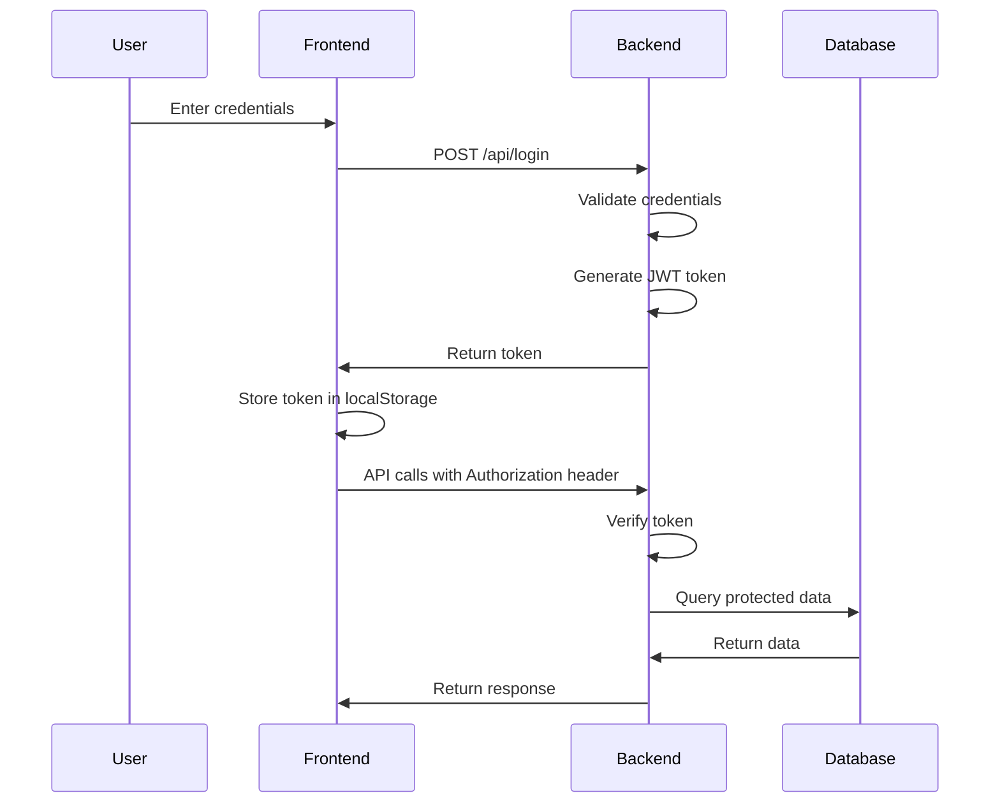

# 📚 Documentação Técnica - Starke ST

## 🏗️ Arquitetura do Sistema

### Visão Geral
O sistema Starke ST é construído com uma arquitetura modular que separa claramente as responsabilidades:

```
┌─────────────────┐    ┌─────────────────┐    ┌─────────────────┐
│   Frontend      │    │   Backend       │    │   Database     │
│   (HTML/CSS/JS) │◄──►│   (Flask API)   │◄──►│   (SQLite)      │
└─────────────────┘    └─────────────────┘    └─────────────────┘
         │                       │                       │
         ▼                       ▼                       ▼
┌─────────────────┐    ┌─────────────────┐    ┌─────────────────┐
│   Login Page    │    │   Auth System    │    │   Messages      │
│   Admin Panel   │    │   Email Service │    │   Budgets       │
│   Landing Page  │    │   CORS Config   │    │   Logs          │
└─────────────────┘    └─────────────────┘    └─────────────────┘
```

## 🔧 Configuração Detalhada

### Estrutura de Configuração

#### 1. Variáveis de Ambiente (.env)
```env
# Email Configuration
EMAIL_USER=starkestsuportetecnico@gmail.com
EMAIL_PASSWORD=your_app_password_here

# Admin Configuration
STARKE_ADMIN_PASSWORD=Starke@2025

# Flask Configuration
FLASK_ENV=development
FLASK_DEBUG=True
SECRET_KEY=your_secret_key_here

# Database Configuration
DATABASE_PATH=backend/database.sqlite3

# CORS Configuration
CORS_ORIGINS=http://localhost,http://127.0.0.1,http://localhost:5000
```

#### 2. Configuração do Flask
```python
# Configurações principais
app.config['MAIL_SERVER'] = 'smtp.gmail.com'
app.config['MAIL_PORT'] = 587
app.config['MAIL_USE_TLS'] = True
app.config['MAIL_USERNAME'] = os.getenv('EMAIL_USER')
app.config['MAIL_PASSWORD'] = os.getenv('EMAIL_PASSWORD')

# Configuração CORS
CORS(app, resources={
    r"/*": {
        "origins": ["http://localhost", "http://127.0.0.1"],
        "methods": ["GET", "POST", "OPTIONS"],
        "allow_headers": ["Content-Type", "Accept", "Authorization"]
    }
})
```

## 🗄️ Estrutura do Banco de Dados

### Schema SQLite

#### Tabela: messages
```sql
CREATE TABLE messages (
    id INTEGER PRIMARY KEY AUTOINCREMENT,
    name TEXT NOT NULL,
    email TEXT NOT NULL,
    subject TEXT NOT NULL,
    message TEXT NOT NULL,
    created_at TEXT NOT NULL
);
```

#### Tabela: budgets
```sql
CREATE TABLE budgets (
    id INTEGER PRIMARY KEY AUTOINCREMENT,
    name TEXT NOT NULL,
    email TEXT NOT NULL,
    phone TEXT NOT NULL,
    service TEXT NOT NULL,
    details TEXT NOT NULL,
    company TEXT,
    city TEXT NOT NULL,
    created_at TEXT NOT NULL
);
```

### Operações de Banco

#### Conexão
```python
def get_db():
    db = sqlite3.connect(DB_PATH)
    db.row_factory = sqlite3.Row
    return db
```

#### Inicialização
```python
def init_db():
    db = get_db()
    # Criação das tabelas
    db.commit()
    db.close()
```

## 🔐 Sistema de Autenticação

### Fluxo de Autenticação



### Implementação de Tokens

#### Geração de Token
```python
import secrets

def generate_token():
    return secrets.token_hex(16)
```

#### Verificação de Token
```python
def verify_token(token):
    return token in token_store

def require_auth(f):
    def decorated_function(*args, **kwargs):
        auth_header = request.headers.get('Authorization', '')
        if not auth_header.startswith('Bearer '):
            return jsonify({'error': 'Token necessário'}), 401
        
        token = auth_header.split(' ', 1)[1].strip()
        if not verify_token(token):
            return jsonify({'error': 'Token inválido'}), 401
        
        return f(*args, **kwargs)
    return decorated_function
```

## 📧 Sistema de Email

### Configuração SMTP

#### Gmail SMTP
```python
app.config['MAIL_SERVER'] = 'smtp.gmail.com'
app.config['MAIL_PORT'] = 587
app.config['MAIL_USE_TLS'] = True
app.config['MAIL_USERNAME'] = 'starkestsuportetecnico@gmail.com'
app.config['MAIL_PASSWORD'] = 'app_password'
```

### Template de Email

#### HTML Template
```html
<html>
<head>
    <style>
        body { font-family: Arial, sans-serif; }
        .container { max-width: 600px; margin: 0 auto; }
        .header { background: #2563EB; color: white; padding: 20px; }
        .content { padding: 20px; }
    </style>
</head>
<body>
    <div class='container'>
        <div class='header'>
            <h2>Novo Orçamento Recebido</h2>
        </div>
        <div class='content'>
            <p><strong>Nome:</strong> {name}</p>
            <p><strong>Email:</strong> {email}</p>
            <p><strong>Assunto:</strong> {subject}</p>
            <p><strong>Mensagem:</strong></p>
            <p>{message}</p>
        </div>
    </div>
</body>
</html>
```

## 🌐 APIs RESTful

### Estrutura de Resposta

#### Sucesso
```json
{
    "status": "success",
    "data": {...},
    "message": "Operação realizada com sucesso"
}
```

#### Erro
```json
{
    "status": "error",
    "error": "Descrição do erro",
    "code": 400
}
```

### Endpoints Detalhados

#### POST /api/login
```python
@app.route('/api/login', methods=['POST'])
def login():
    data = request.get_json()
    email = data.get('email')
    password = data.get('password')
    
    if validate_credentials(email, password):
        token = generate_token()
        token_store.add(token)
        return jsonify({'token': token})
    
    return jsonify({'error': 'Credenciais inválidas'}), 401
```

#### GET /api/messages
```python
@app.route('/api/messages', methods=['GET'])
@require_auth
def list_messages():
    page = int(request.args.get('page', 1))
    page_size = int(request.args.get('page_size', 10))
    
    db = get_db()
    total = db.execute('SELECT COUNT(1) as c FROM messages').fetchone()['c']
    rows = db.execute(
        'SELECT * FROM messages ORDER BY created_at DESC LIMIT ? OFFSET ?',
        (page_size, (page - 1) * page_size)
    ).fetchall()
    
    return jsonify({
        'items': [dict(row) for row in rows],
        'total': total,
        'page': page,
        'page_size': page_size
    })
```

## 🎨 Frontend Architecture

### Estrutura de Arquivos
```
frontend/
├── index.html          # Landing page principal
├── login.html          # Página de login
├── main.css           # Estilos principais
├── main.js            # Scripts principais
└── assets/           # Recursos estáticos
    ├── css/          # Estilos adicionais
    ├── js/           # Scripts específicos
    ├── img/          # Imagens
    └── icons/        # Ícones
```

### JavaScript Modules

#### Sistema de Login
```javascript
class AuthManager {
    constructor() {
        this.token = localStorage.getItem('starke_admin_token') || '';
        this.apiBase = window.location.origin;
    }

    async login(email, password) {
        const response = await fetch(`${this.apiBase}/api/login`, {
            method: 'POST',
            headers: { 'Content-Type': 'application/json' },
            body: JSON.stringify({ email, password })
        });

        if (response.ok) {
            const data = await response.json();
            this.token = data.token;
            localStorage.setItem('starke_admin_token', this.token);
            return true;
        }
        return false;
    }

    async logout() {
        await fetch(`${this.apiBase}/api/logout`, {
            method: 'POST',
            headers: { 'Authorization': `Bearer ${this.token}` }
        });
        
        this.token = '';
        localStorage.removeItem('starke_admin_token');
    }

    isAuthenticated() {
        return !!this.token;
    }
}
```

#### Gerenciador de API
```javascript
class APIManager {
    constructor(authManager) {
        this.auth = authManager;
        this.apiBase = window.location.origin;
    }

    async request(endpoint, options = {}) {
        const headers = {
            'Content-Type': 'application/json',
            ...options.headers
        };

        if (this.auth.isAuthenticated()) {
            headers['Authorization'] = `Bearer ${this.auth.token}`;
        }

        const response = await fetch(`${this.apiBase}${endpoint}`, {
            ...options,
            headers
        });

        if (!response.ok) {
            throw new Error(`API Error: ${response.status}`);
        }

        return response.json();
    }

    async getMessages(page = 1, pageSize = 10) {
        return this.request(`/api/messages?page=${page}&page_size=${pageSize}`);
    }

    async getBudgets(page = 1, pageSize = 10) {
        return this.request(`/api/budgets?page=${page}&page_size=${pageSize}`);
    }
}
```

## 🧪 Testes

### Testes Unitários

#### Teste de Autenticação
```python
import unittest
from app import app, token_store

class TestAuth(unittest.TestCase):
    def setUp(self):
        self.app = app.test_client()
        self.app.testing = True

    def test_login_success(self):
        response = self.app.post('/api/login', 
            json={'email': 'Superadm@starkeST.com', 'password': 'Starke@2025'})
        self.assertEqual(response.status_code, 200)
        data = response.get_json()
        self.assertIn('token', data)

    def test_login_failure(self):
        response = self.app.post('/api/login',
            json={'email': 'wrong@email.com', 'password': 'wrong'})
        self.assertEqual(response.status_code, 401)

    def test_protected_route(self):
        # Primeiro fazer login
        login_response = self.app.post('/api/login',
            json={'email': 'Superadm@starkeST.com', 'password': 'Starke@2025'})
        token = login_response.get_json()['token']

        # Testar rota protegida
        response = self.app.get('/api/messages',
            headers={'Authorization': f'Bearer {token}'})
        self.assertEqual(response.status_code, 200)
```

### Testes de Integração

#### Teste de Fluxo Completo
```python
def test_complete_flow():
    # 1. Acessar página principal
    response = client.get('/')
    assert response.status_code == 200

    # 2. Fazer login
    login_response = client.post('/api/login', json={
        'email': 'Superadm@starkeST.com',
        'password': 'Starke@2025'
    })
    token = login_response.json['token']

    # 3. Acessar área administrativa
    admin_response = client.get('/backend/admin.html')
    assert admin_response.status_code == 200

    # 4. Listar mensagens
    messages_response = client.get('/api/messages',
        headers={'Authorization': f'Bearer {token}'})
    assert messages_response.status_code == 200

    # 5. Fazer logout
    logout_response = client.post('/api/logout',
        headers={'Authorization': f'Bearer {token}'})
    assert logout_response.status_code == 200
```

## 📊 Monitoramento e Logs

### Configuração de Logs

```python
import logging

# Configuração básica
logging.basicConfig(
    level=logging.INFO,
    format='%(asctime)s - %(levelname)s - %(message)s',
    handlers=[
        logging.FileHandler('app.log'),
        logging.StreamHandler()
    ]
)

logger = logging.getLogger(__name__)

# Uso nos endpoints
@app.route('/api/login', methods=['POST'])
def login():
    logger.info(f"Tentativa de login: {email}")
    # ... lógica de login
    logger.info(f"Login bem-sucedido para {email}")
```

### Métricas Importantes

- **Tentativas de login**: Sucesso/Falha
- **Mensagens recebidas**: Volume e frequência
- **Orçamentos solicitados**: Conversão
- **Erros de API**: Frequência e tipos
- **Performance**: Tempo de resposta

## 🚀 Deploy e Produção

### Configuração de Produção

#### Gunicorn
```bash
# Instalação
pip install gunicorn

# Execução
gunicorn -w 4 -b 0.0.0.0:5000 app:app

# Com configuração
gunicorn -c gunicorn.conf.py app:app
```

#### Configuração Gunicorn
```python
# gunicorn.conf.py
bind = "0.0.0.0:5000"
workers = 4
worker_class = "sync"
worker_connections = 1000
timeout = 30
keepalive = 2
max_requests = 1000
max_requests_jitter = 100
```

### Docker

#### Dockerfile
```dockerfile
FROM python:3.9-slim

WORKDIR /app

COPY requirements.txt .
RUN pip install -r requirements.txt

COPY . .

EXPOSE 5000

CMD ["gunicorn", "-w", "4", "-b", "0.0.0.0:5000", "app:app"]
```

#### Docker Compose
```yaml
version: '3.8'
services:
  web:
    build: .
    ports:
      - "5000:5000"
    environment:
      - FLASK_ENV=production
      - EMAIL_USER=${EMAIL_USER}
      - EMAIL_PASSWORD=${EMAIL_PASSWORD}
    volumes:
      - ./backend:/app/backend
```

## 🔧 Manutenção

### Backup do Banco
```bash
# Backup manual
cp backend/database.sqlite3 backup/database_$(date +%Y%m%d).sqlite3

# Backup automático (cron)
0 2 * * * cp /path/to/database.sqlite3 /backup/database_$(date +\%Y\%m\%d).sqlite3
```

### Limpeza de Logs
```bash
# Rotacionar logs
logrotate /etc/logrotate.d/starke-st

# Limpar logs antigos
find /var/log -name "app.log.*" -mtime +30 -delete
```

### Atualizações
```bash
# Atualizar dependências
pip install --upgrade -r requirements.txt

# Verificar vulnerabilidades
pip install safety
safety check

# Atualizar sistema
pip install --upgrade pip setuptools wheel
```

---

**Documentação técnica completa para desenvolvedores Starke ST** 🚀
